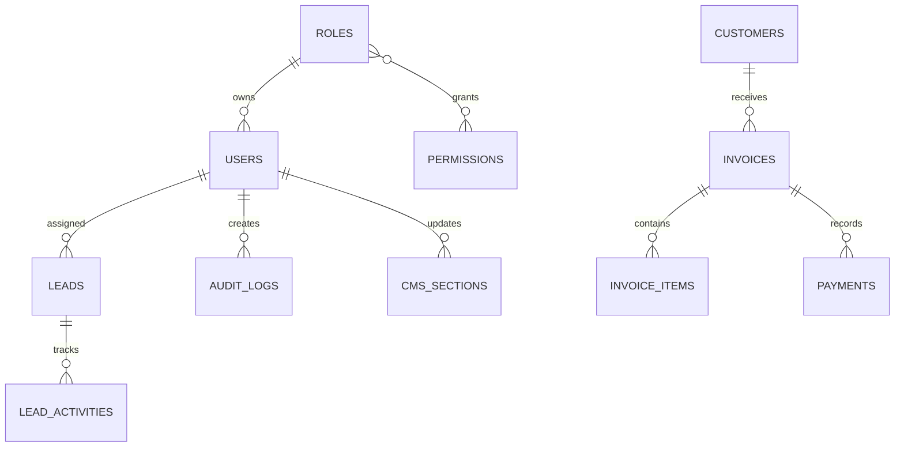

# Adxon Enterprise Admin Blueprint

## Product Scope

Adxon Admin combines CRM, CMS, analytics, invoice management, RBAC, reporting, notifications, global search, and audit logging for a digital agency website.

## Information Architecture

- Dashboard
- Lead Center
- Invoices
- Users & Roles
- Reports
- Global Search
- CMS
  - Home
  - Promotional Header
  - About
  - Services
  - Packages
  - Contact
- Settings & SEO

## User Flows

### Login

1. User opens `/admin/login`.
2. User enters owner credentials or created user email/password.
3. Password is validated against env credentials or hashed JSON user credentials.
4. Session stores user name, email, role, and permissions.
5. User lands on dashboard.

### Lead Management

1. New lead arrives from website or admin creates lead manually.
2. Lead appears in table and Kanban pipeline.
3. Admin changes stage: New Lead, Qualified, Not Qualified, Lost, Converted.
4. Admin assigns team member, adds notes, and sets reminder.
5. Activity is logged.

### Invoice Management

1. Admin creates invoice from customer information.
2. Invoice number is generated automatically.
3. Admin sets due date, billing type, total, paid amount, and payment status.
4. Balance and payment analytics update.
5. Admin can prepare preview, PDF, print, email, WhatsApp, duplicate, and reminders.

## Database Schema

Current implementation uses JSON storage for speed of delivery:

- `storage/app/adxon/content.json`
- `storage/app/adxon/admin.json`

Recommended MySQL tables for production:

```sql
users(id, name, email, password, role_id, status, created_at, updated_at)
roles(id, name, description, created_at, updated_at)
permissions(id, key, label, created_at, updated_at)
permission_role(role_id, permission_id)
leads(id, date, name, company, email, phone, location, website, service, package, source, stage, assigned_user_id, reminder_at, notes, created_at, updated_at)
lead_activities(id, lead_id, user_id, type, body, created_at)
customers(id, name, email, phone, business, gst, billing_address, created_at, updated_at)
invoices(id, invoice_no, customer_id, invoice_date, due_date, billing_type, status, subtotal, tax, discount, total, paid, balance, created_at, updated_at)
invoice_items(id, invoice_id, description, quantity, price, tax, discount, total)
payments(id, invoice_id, date, amount, method, notes, remaining_balance)
cms_sections(id, key, title, payload_json, status, sort_order, updated_by, created_at, updated_at)
reports(id, type, filters_json, generated_by, file_path, created_at)
notifications(id, user_id, type, message, read_at, created_at)
audit_logs(id, user_id, action, subject_type, subject_id, metadata_json, ip, created_at)
```

## ER Diagram



## API Documentation

Recommended REST endpoints:

```text
POST   /api/auth/login
POST   /api/auth/logout
GET    /api/dashboard/analytics
GET    /api/leads
POST   /api/leads
GET    /api/leads/{id}
PATCH  /api/leads/{id}
DELETE /api/leads/{id}
GET    /api/invoices
POST   /api/invoices
GET    /api/invoices/{id}
PATCH  /api/invoices/{id}
POST   /api/invoices/{id}/payments
POST   /api/invoices/{id}/reminders
GET    /api/cms/sections
PATCH  /api/cms/sections/{key}
GET    /api/users
POST   /api/users
PATCH  /api/users/{id}
GET    /api/reports/{type}
GET    /api/search?q=
GET    /api/audit-logs
```

## Component Library

- Sidebar navigation
- Sticky topbar
- Metric cards
- Date filter pills
- Bar chart cards
- Donut chart card
- Funnel card
- Kanban board
- Responsive data table
- Form panel
- Permission checkbox matrix
- Notification list
- Audit log list
- Theme toggle
- Toast/status message

## Production Hardening

- Move JSON storage to MySQL repositories.
- Add Laravel policies and middleware for permission checks.
- Add server-side pagination, filtering, and sorting.
- Add queues for email, WhatsApp, report generation, and notifications.
- Add Redis cache for analytics and session performance.
- Add SMTP, WhatsApp Business API, Google Analytics 4, Meta Conversion API, and Google Maps integrations.
- Add real PDF generation for invoices and reports.
- Add forgot password, optional two-factor authentication, and session timeout rules.
